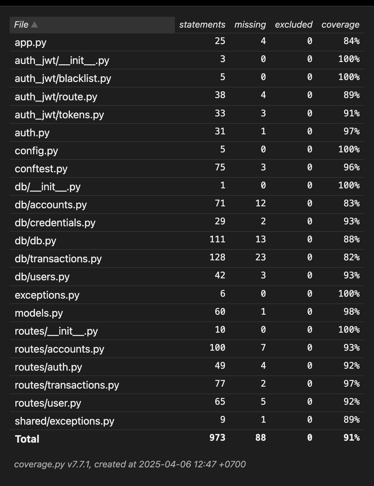

# RevoBank API

A RESTful API for the RevoBank application, implemented with Python and Flask. This API provides banking functionalities including user management, account management, and transactions.

## Documentation

For detailed documentation, please refer to:
- [API Documentation](docs/api_documentation.md) - Complete API reference and usage
- [Database Models](docs/db_models.md) - Database schema and models
- [Activity Diagrams](docs/activity_diagram.md) - System workflows and processes

## Features

- User authentication and authorization with JWT
- Account management (create, read, update, delete)
- Transaction management (deposits, withdrawals, transfers)
- Bill management (create, track, and manage bills)
- Budget planning and tracking
- Transaction categorization
- SQL support through sqlalchemy ORM
- Role-based access control
- Automated test run on git push through [GitHub Actions](https://github.com/features/actions)
- Unit testing with coverage report
- Docker compose file for deploying a complete system with PostgreSQL and Adminer DBMS

## Installation

1. Clone the repository
2. Syncronize the dependencies
   ```bash
   uv sync
   ```
3. Set these required environment variables:
   - `DB_CONN`: database connection string, use `sqlite:///` for in-memory database.
   - `JWT_SECRET`: randomly generated string for generating JWT signature.
   - `JWT_ALGORITHM` (optional, default to `HS256`).
4. Start the server:
   ```bash
   uv run ./main.py
   ```
   or, on production use `gunicorn` instead:
   ```bash
   gunicorn 'app:create_app()'
   ```

## Testing and Code Coverage

To run tests (with code coverage, current coverage is around 91%):
```bash
uv run pytest --cov=
```

There's a shell script for generating HTML-based coverage:
```bash
./scripts/html-cov.sh
```

Latest coverage:


## Live API
This API is hosted on [koyeb](https://app.koyeb.com/), using free-tier service and free-tier PostgreSQL database. The server is up and ready for public access at [this link](https://disciplinary-sisile-dang0ta-1963dd4c.koyeb.app).