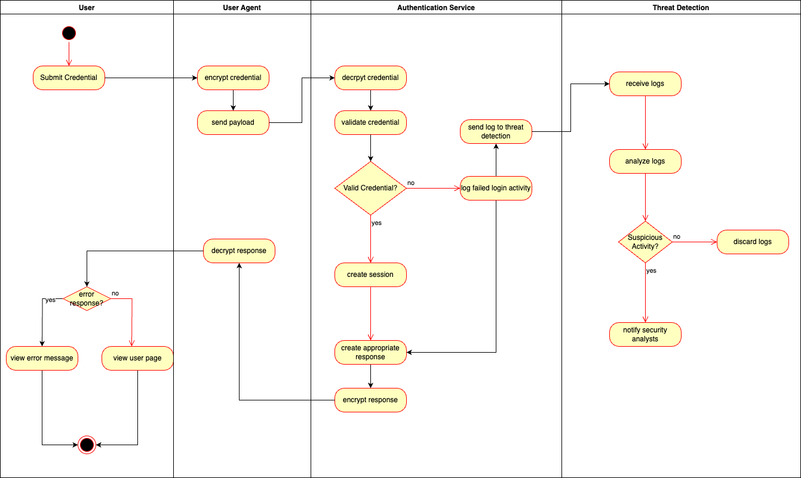
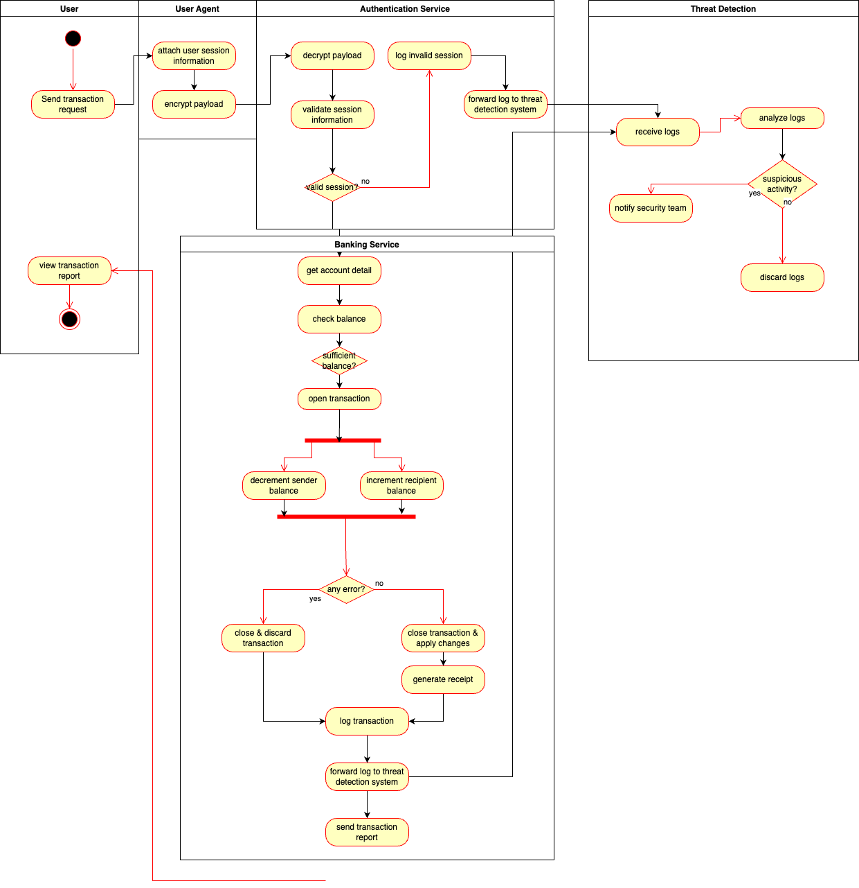

# RevoBank 

## Activity Diagram

### User Authentication

- Upon submitting credentials, user agents (typically web browsers) will handle the encryption of the credentials through TLS and send the encrypted payload to the system.
- The Authentication Service will be the first service to receive the payload. This service will decrypt the payload and then validate the credentials.
- If the submitted credentials are valid, it will proceed to create a new session for the user, generate a response that includes the session information, encrypt it, and send it back to the user.
- If the submitted credentials are invalid, an error response is generated along with a failed login activity log. The response will get encrypted and sent back to the user, and the activity log will be forwarded to the threat analysis system for threat detection.
- On the user side, the user agent will automatically decrypt the response. The user device then checks whether the response is an error response or not. If yes, the error message will be displayed; otherwise, the user will be redirected to the user page.

### Transaction

- Upon submitting a transaction request, user agents (typically web browsers) will include the user session with the request, encrypt the request through TLS, and then send the payload to the system.
- The system then receives the payload, and the authentication service will be the first service to process the payload.
- The authentication service decrypts the payload and verifies the user session information.
- If the session is invalid, an Unauthorized response is sent to the user. It also creates an activity log and forwards it to the threat detection system for activity analysis.
- If the session is valid, it forwards the request to the Banking Service.
- The Banking Service then gets the account details of the requester and checks their balance. If the balance is insufficient, the transaction is rejected, and a response with a rejection message is sent to the user.
- If the balance is sufficient, a transaction is created, and two actions are carried out: reducing the sender's balance and adding to the recipient's balance. Any error that occurs during any of these processes will revert the changes made, ensuring no faulty changes are made. If no error occurs, a transaction receipt is generated, and the changes are applied to both the sender's and recipient's accounts.
- The Banking Service then generates a transaction log and sends it to the threat detection service for activity analysis. The Banking Service then generates a response that includes a transaction receipt if the transaction was successful, or a transaction report if it failed.
- The response is then encrypted and sent back to the user.